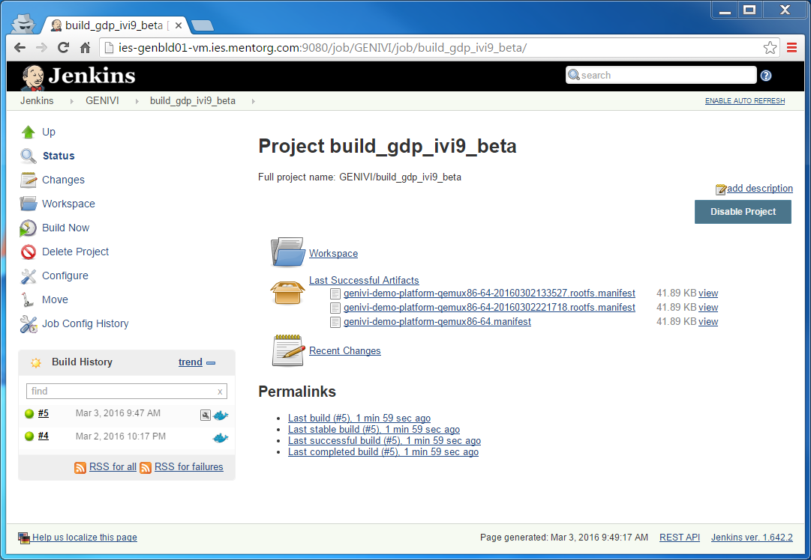
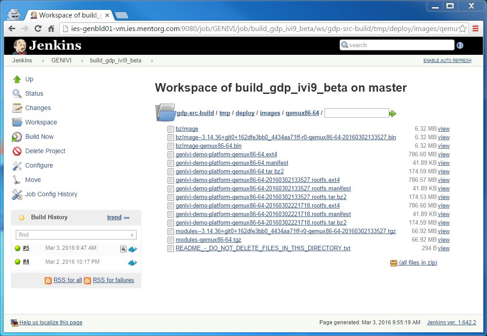

# Building GDP ivi9 beta using easy-jenkins

## Introduction

<!-- (2016-02-23 16:00 CET) -->

This document explains how to build from sources the [GENIVI Demo Platform](http://projects.genivi.org/genivi-demo-platform/home) using [Jenkins](https://jenkins-ci.org/).

Rather then performing the build inside a Jenkins [dumb slave node](https://wiki.jenkins-ci.org/display/JENKINS/Step+by+step+guide+to+set+up+master+and+slave+machines), the build is performed inside a custom [Docker container](https://wiki.jenkins-ci.org/display/JENKINS/Docker+Plugin).

The instructions inside this document have been tested on

* Docker client: itm-gmacario-w7 (MS Windows 7 64-bit, Docker Toolbox 1.10.2)
* Docker engine: ies-genbld01-vm (Ubuntu 14.04.4 LTS 64-bit, Docker 1.10.1, Docker Compose 1.6.0)

<!-- mv-linux-powerhorse (Ubuntu 14.04.4 LTS 64-bit, Docker 1.10.0, Docker Compose 1.6.0) -->

## Preparation

* Install and configure [easy-jenkins](https://github.com/gmacario/easy-jenkins) - please refer to [preparation.md](https://github.com/gmacario/easy-jenkins/blob/master/docs/preparation.md) for details.
* Verify that the Jenkins Dashboard is accessible at `${DOCKER_URL}` (example: http://192.168.99.100:9080/)

## Step-by-step instructions

### Create folder `GENIVI`

Browse `${DOCKER_URL}`, then click **New Item**

* Name: `GENIVI`
* Type: **Folder**

then click **OK**. Inside the project configuration page, review configuration, then click **OK**.

### Create project `build_gdp_ivi9_beta`

<!-- (2016-03-03 10:43 CET) -->

Browse `${DOCKER_URL}/job/GENIVI`, then click **New Item**

* Name: `build_gdp_ivi9_beta`
* Type: **Freestyle project**

then click **OK**. Inside the project configuration page, add the following information:

* Discard Old Builds: Yes
  - Strategy: Log Rotation
    - Days to keep build: (none)
    - Max # of builds to keep: 2
* Source Code Management: Git
  - Repositories
    - Repository URL: `git://git.projects.genivi.org/genivi-demo-platform.git`
    - Credentials: - none -
  - Branches to build
    - Branch Specifier (blank for 'any'): `*/qemux86-64-ivi9-beta`
  - Repository browser: (Auto)
* Build Environment
  - Build inside a Docker container: Yes
    - Docker image to use: Pull docker image from repository
      - Image id/tag: `gmacario/build-yocto-genivi`
    - Advanced...
      - force Pull: Yes
* Build
  - Execute shell
    - Command
```
#!/bin/bash -xe

# DEBUG
id
pwd
ls -la
printenv | sort

# Configure git
git config --global user.name "easy-jenkins"
git config --global user.email "$(whoami)@$(hostname)"

# Configure the build
source init.sh

# Prevent error "Do not use Bitbake as root"
[ $(whoami) = "root" ] && touch conf/sanity.conf

# Perform the actual build
bitbake genivi-demo-platform

# EOF
```

* Post-build Actions
  - Archive the artifacts
    - Files to archive

```
gdp-src-build/tmp/deploy/images/*/*.manifest
```

then click **Save**.

### Build project `build_gdp_ivi9_beta`

Browse `${JENKINS_URL}/job/GENIVI/job/build_gdp_ivi9_beta/`, then click **Build Now**.

You may watch the build logs at `${JENKINS_URL}/job/GENIVI/job/build_gdp_ivi9_beta/lastBuild/console`

<!-- (2016-03-03 10:47 CET) http://ies-genbld01-vm.ies.mentorg.com:9080/job/GENIVI/job/build_gdp_ivi9_beta/5/console -->

```
Started by user anonymous
[EnvInject] - Loading node environment variables.
Building in workspace /var/jenkins_home/workspace/GENIVI/build_gdp_ivi9_beta
 > git rev-parse --is-inside-work-tree # timeout=10
Fetching changes from the remote Git repository
 > git config remote.origin.url git://git.projects.genivi.org/genivi-demo-platform.git # timeout=10
Fetching upstream changes from git://git.projects.genivi.org/genivi-demo-platform.git
 > git --version # timeout=10
 > git -c core.askpass=true fetch --tags --progress git://git.projects.genivi.org/genivi-demo-platform.git +refs/heads/*:refs/remotes/origin/*
 > git rev-parse refs/remotes/origin/qemux86-64-ivi9-beta^{commit} # timeout=10
 > git rev-parse refs/remotes/origin/origin/qemux86-64-ivi9-beta^{commit} # timeout=10
Checking out Revision 6e50965700f98572eaa731e426d561b1b5031c87 (refs/remotes/origin/qemux86-64-ivi9-beta)
 > git config core.sparsecheckout # timeout=10
 > git checkout -f 6e50965700f98572eaa731e426d561b1b5031c87
 > git rev-list 6e50965700f98572eaa731e426d561b1b5031c87 # timeout=10
Docker container 62d0ae51a9c4326a8cdc7c4dfd1c913093fd78c7aa4aa96ff6e1d73fb8ebf90c started to host the build
$ docker exec --tty 62d0ae51a9c4326a8cdc7c4dfd1c913093fd78c7aa4aa96ff6e1d73fb8ebf90c env
[build_gdp_ivi9_beta] $ docker exec --tty --user 1000:1000 62d0ae51a9c4326a8cdc7c4dfd1c913093fd78c7aa4aa96ff6e1d73fb8ebf90c env 'BASH_FUNC_copy_reference_file%%=() {  f="${1%/}";
 b="${f%.override}";
 echo "$f" >> "$COPY_REFERENCE_FILE_LOG";
 rel="${b:23}";
 dir=$(dirname "${b}");
 echo " $f -> $rel" >> "$COPY_REFERENCE_FILE_LOG";
 if [[ ! -e /var/jenkins_home/${rel} || $f = *.override ]]; then
 echo "copy $rel to JENKINS_HOME" >> "$COPY_REFERENCE_FILE_LOG";
 mkdir -p "/var/jenkins_home/${dir:23}";
 cp -r "${f}" "/var/jenkins_home/${rel}";
 [[ ${rel} == plugins/*.jpi ]] && touch "/var/jenkins_home/${rel}.pinned";
 fi
}' BUILD_CAUSE=MANUALTRIGGER BUILD_CAUSE_MANUALTRIGGER=true BUILD_DISPLAY_NAME=#5 BUILD_ID=5 BUILD_NUMBER=5 BUILD_TAG=jenkins-GENIVI-build_gdp_ivi9_beta-5 CA_CERTIFICATES_JAVA_VERSION=20140324 CLASSPATH= COPY_REFERENCE_FILE_LOG=/var/jenkins_home/copy_reference_file.log EXECUTOR_NUMBER=0 GIT_BRANCH=origin/qemux86-64-ivi9-beta GIT_COMMIT=6e50965700f98572eaa731e426d561b1b5031c87 GIT_PREVIOUS_COMMIT=6e50965700f98572eaa731e426d561b1b5031c87 GIT_PREVIOUS_SUCCESSFUL_COMMIT=6e50965700f98572eaa731e426d561b1b5031c87 GIT_URL=git://git.projects.genivi.org/genivi-demo-platform.git HOME=/var/jenkins_home HOSTNAME=9a260eff78c8 HUDSON_HOME=/var/jenkins_home HUDSON_SERVER_COOKIE=d73dd7a3cff408ad JAVA_DEBIAN_VERSION=8u72-b15-1~bpo8+1 JAVA_HOME=/usr/lib/jvm/java-8-openjdk-amd64 JAVA_VERSION=8u72 JENKINS_HOME=/var/jenkins_home JENKINS_SERVER_COOKIE=d73dd7a3cff408ad JENKINS_SHA=e72e06e64d23eefb13090459f517b0697aad7be0 JENKINS_SLAVE_AGENT_PORT=50000 JENKINS_UC=https://updates.jenkins-ci.org JENKINS_VERSION=1.642.2 JOB_NAME=GENIVI/build_gdp_ivi9_beta LANG=C.UTF-8 NODE_LABELS=master NODE_NAME=master PATH=/usr/local/sbin:/usr/local/bin:/usr/sbin:/usr/bin:/sbin:/bin PWD=/ ROOT_BUILD_CAUSE=MANUALTRIGGER ROOT_BUILD_CAUSE_MANUALTRIGGER=true SHLVL=2 TERM=xterm TINI_SHA=066ad710107dc7ee05d3aa6e4974f01dc98f3888 WORKSPACE=/var/jenkins_home/workspace/GENIVI/build_gdp_ivi9_beta /bin/bash -xe /tmp/hudson3989190526745719821.sh
+ id
uid=1000(build) gid=1000(build) groups=1000(build)
+ pwd
/var/jenkins_home/workspace/GENIVI/build_gdp_ivi9_beta
+ ls -la
total 52
drwxr-xr-x  9 build build 4096 Mar  2 06:26 .
drwxr-xr-x  3 build build 4096 Mar  2 06:26 ..
drwxr-xr-x 10 build build 4096 Mar  3 09:47 .git
-rw-r--r--  1 build build  204 Mar  2 06:26 .gitignore
-rw-r--r--  1 build build  470 Mar  2 06:26 .gitmodules
-rw-r--r--  1 build build  805 Mar  2 06:26 README.md
drwxr-xr-x  8 build build 4096 Mar  2 18:41 gdp-src-build
-rw-r--r--  1 build build  908 Mar  2 06:26 init.sh
drwxr-xr-x 15 build build 4096 Mar  2 06:30 meta-genivi-demo
drwxr-xr-x  6 build build 4096 Mar  2 06:30 meta-ivi
drwxr-xr-x 18 build build 4096 Mar  2 06:30 meta-openembedded
drwxr-xr-x  7 build build 4096 Mar  2 06:30 meta-qt5
drwxr-xr-x 10 build build 4096 Mar  2 06:31 poky
+ printenv
+ sort
 [[ ${rel} == plugins/*.jpi ]] && touch "/var/jenkins_home/${rel}.pinned";
 b="${f%.override}";
 cp -r "${f}" "/var/jenkins_home/${rel}";
 dir=$(dirname "${b}");
 echo " $f -> $rel" >> "/var/jenkins_home/copy_reference_file.log";
 echo "$f" >> "/var/jenkins_home/copy_reference_file.log";
 echo "copy $rel to JENKINS_HOME" >> "/var/jenkins_home/copy_reference_file.log";
 fi
 if [[ ! -e /var/jenkins_home/${rel} || $f = *.override ]]; then
 mkdir -p "/var/jenkins_home/${dir:23}";
 rel="${b:23}";
BASH_FUNC_copy_reference_file%%=() {  f="${1%/}";
BUILD_CAUSE=MANUALTRIGGER
BUILD_CAUSE_MANUALTRIGGER=true
BUILD_DISPLAY_NAME=#5
BUILD_ID=5
BUILD_NUMBER=5
BUILD_TAG=jenkins-GENIVI-build_gdp_ivi9_beta-5
CA_CERTIFICATES_JAVA_VERSION=20140324
CLASSPATH=
COPY_REFERENCE_FILE_LOG=/var/jenkins_home/copy_reference_file.log
EXECUTOR_NUMBER=0
GIT_BRANCH=origin/qemux86-64-ivi9-beta
GIT_COMMIT=6e50965700f98572eaa731e426d561b1b5031c87
GIT_PREVIOUS_COMMIT=6e50965700f98572eaa731e426d561b1b5031c87
GIT_PREVIOUS_SUCCESSFUL_COMMIT=6e50965700f98572eaa731e426d561b1b5031c87
GIT_URL=git://git.projects.genivi.org/genivi-demo-platform.git
HOME=/var/jenkins_home
HOSTNAME=9a260eff78c8
HUDSON_HOME=/var/jenkins_home
HUDSON_SERVER_COOKIE=d73dd7a3cff408ad
JAVA_DEBIAN_VERSION=8u72-b15-1~bpo8+1
JAVA_HOME=/usr/lib/jvm/java-8-openjdk-amd64
JAVA_VERSION=8u72
JENKINS_HOME=/var/jenkins_home
JENKINS_SERVER_COOKIE=d73dd7a3cff408ad
JENKINS_SHA=e72e06e64d23eefb13090459f517b0697aad7be0
JENKINS_SLAVE_AGENT_PORT=50000
JENKINS_UC=https://updates.jenkins-ci.org
JENKINS_VERSION=1.642.2
JOB_NAME=GENIVI/build_gdp_ivi9_beta
LANG=C.UTF-8
NODE_LABELS=master
NODE_NAME=master
PATH=/usr/local/sbin:/usr/local/bin:/usr/sbin:/usr/bin:/sbin:/bin
PWD=/var/jenkins_home/workspace/GENIVI/build_gdp_ivi9_beta
ROOT_BUILD_CAUSE=MANUALTRIGGER
ROOT_BUILD_CAUSE_MANUALTRIGGER=true
SHLVL=3
TERM=xterm
TINI_SHA=066ad710107dc7ee05d3aa6e4974f01dc98f3888
WORKSPACE=/var/jenkins_home/workspace/GENIVI/build_gdp_ivi9_beta
_=/usr/bin/printenv
}
+ git config --global user.name easy-jenkins
++ whoami
++ hostname
+ git config --global user.email build@62d0ae51a9c4
+ source init.sh
+++ basename /tmp/hudson3989190526745719821.sh
++ cmd=hudson3989190526745719821.sh
++ '[' hudson3989190526745719821.sh = init.sh ']'
++ git submodule init
++ git submodule sync
Synchronizing submodule url for 'meta-genivi-demo'
Synchronizing submodule url for 'meta-ivi'
Synchronizing submodule url for 'meta-openembedded'
Synchronizing submodule url for 'meta-qt5'
Synchronizing submodule url for 'poky'
++ git submodule update
++ source poky/oe-init-build-env gdp-src-build
+++ '[' -n poky/oe-init-build-env ']'
++++ dirname poky/oe-init-build-env
+++ OEROOT=poky
+++ '[' -n '' ']'
+++ THIS_SCRIPT=poky/oe-init-build-env
+++ '[' -z '' ']'
+++ '[' /tmp/hudson3989190526745719821.sh = poky/oe-init-build-env ']'
++++ readlink -f poky
+++ OEROOT=/var/jenkins_home/workspace/GENIVI/build_gdp_ivi9_beta/poky
+++ export OEROOT
+++ . /var/jenkins_home/workspace/GENIVI/build_gdp_ivi9_beta/poky/scripts/oe-buildenv-internal
++++ '[' -z /var/jenkins_home/workspace/GENIVI/build_gdp_ivi9_beta/poky ']'
++++ '[' -z '' -a '!' -z '' ']'
+++++ /usr/bin/env python --version
+++++ grep 'Python 3'
++++ py_v3_check=
++++ '[' '' '!=' '' ']'
+++++ python -c 'import sys; print sys.version_info >= (2,7,3)'
++++ py_v26_check=True
++++ '[' True '!=' True ']'
++++ '[' x = x ']'
++++ '[' xgdp-src-build = x ']'
++++ BDIR=gdp-src-build
++++ '[' gdp-src-build = / ']'
+++++ echo gdp-src-build
+++++ sed -re 's|/+$||'
++++ BDIR=gdp-src-build
+++++ readlink -f gdp-src-build
++++ BDIR=/var/jenkins_home/workspace/GENIVI/build_gdp_ivi9_beta/gdp-src-build
++++ '[' -z /var/jenkins_home/workspace/GENIVI/build_gdp_ivi9_beta/gdp-src-build ']'
++++ '[' x '!=' x ']'
++++ expr /var/jenkins_home/workspace/GENIVI/build_gdp_ivi9_beta/gdp-src-build : '/.*'
++++ BUILDDIR=/var/jenkins_home/workspace/GENIVI/build_gdp_ivi9_beta/gdp-src-build
++++ unset BDIR
++++ '[' x = x ']'
++++ BITBAKEDIR=/var/jenkins_home/workspace/GENIVI/build_gdp_ivi9_beta/poky/bitbake/
+++++ readlink -f /var/jenkins_home/workspace/GENIVI/build_gdp_ivi9_beta/poky/bitbake/
++++ BITBAKEDIR=/var/jenkins_home/workspace/GENIVI/build_gdp_ivi9_beta/poky/bitbake
+++++ readlink -f /var/jenkins_home/workspace/GENIVI/build_gdp_ivi9_beta/gdp-src-build
++++ BUILDDIR=/var/jenkins_home/workspace/GENIVI/build_gdp_ivi9_beta/gdp-src-build
++++ test -d /var/jenkins_home/workspace/GENIVI/build_gdp_ivi9_beta/poky/bitbake
++++ NEWPATHS=/var/jenkins_home/workspace/GENIVI/build_gdp_ivi9_beta/poky/scripts:/var/jenkins_home/workspace/GENIVI/build_gdp_ivi9_beta/poky/bitbake/bin:
+++++ echo /usr/local/sbin:/usr/local/bin:/usr/sbin:/usr/bin:/sbin:/bin
+++++ sed -e 's|:/var/jenkins_home/workspace/GENIVI/build_gdp_ivi9_beta/poky/scripts:/var/jenkins_home/workspace/GENIVI/build_gdp_ivi9_beta/poky/bitbake/bin:|:|g' -e 's|^/var/jenkins_home/workspace/GENIVI/build_gdp_ivi9_beta/poky/scripts:/var/jenkins_home/workspace/GENIVI/build_gdp_ivi9_beta/poky/bitbake/bin:||'
++++ PATH=/var/jenkins_home/workspace/GENIVI/build_gdp_ivi9_beta/poky/scripts:/var/jenkins_home/workspace/GENIVI/build_gdp_ivi9_beta/poky/bitbake/bin:/usr/local/sbin:/usr/local/bin:/usr/sbin:/usr/bin:/sbin:/bin
++++ unset BITBAKEDIR NEWPATHS
++++ export BUILDDIR
++++ export PATH
++++ export 'BB_ENV_EXTRAWHITE=MACHINE DISTRO TCMODE TCLIBC HTTP_PROXY http_proxy HTTPS_PROXY https_proxy FTP_PROXY ftp_proxy FTPS_PROXY ftps_proxy ALL_PROXY all_proxy NO_PROXY no_proxy SSH_AGENT_PID SSH_AUTH_SOCK BB_SRCREV_POLICY SDKMACHINE BB_NUMBER_THREADS BB_NO_NETWORK PARALLEL_MAKE GIT_PROXY_COMMAND SOCKS5_PASSWD SOCKS5_USER SCREENDIR STAMPS_DIR'
++++ BB_ENV_EXTRAWHITE='MACHINE DISTRO TCMODE TCLIBC HTTP_PROXY http_proxy HTTPS_PROXY https_proxy FTP_PROXY ftp_proxy FTPS_PROXY ftps_proxy ALL_PROXY all_proxy NO_PROXY no_proxy SSH_AGENT_PID SSH_AUTH_SOCK BB_SRCREV_POLICY SDKMACHINE BB_NUMBER_THREADS BB_NO_NETWORK PARALLEL_MAKE GIT_PROXY_COMMAND SOCKS5_PASSWD SOCKS5_USER SCREENDIR STAMPS_DIR'
+++ /var/jenkins_home/workspace/GENIVI/build_gdp_ivi9_beta/poky/scripts/oe-setup-builddir

### Shell environment set up for builds. ###

You can now run 'bitbake <target>'

Common targets are:
    core-image-minimal
    core-image-sato
    meta-toolchain
    adt-installer
    meta-ide-support

You can also run generated qemu images with a command like 'runqemu qemux86'
+++ '[' -n /var/jenkins_home/workspace/GENIVI/build_gdp_ivi9_beta/gdp-src-build ']'
+++ cd /var/jenkins_home/workspace/GENIVI/build_gdp_ivi9_beta/gdp-src-build
+++ unset OEROOT
+++ unset BBPATH
+++ unset THIS_SCRIPT
+++ '[' -z '' ']'
+++ '[' -f bitbake.lock ']'
+++ grep : bitbake.lock
+++ '[' 1 = 0 ']'
++ echo

++ echo 'Now run:  bitbake genivi-demo-platform'
Now run:  bitbake genivi-demo-platform
++ whoami
+ '[' build = root ']'
+ bitbake genivi-demo-platform
Loading cache:   0% || ETA:  --:--:--
...
Loading cache: 100% || ETA:  00:00:00

Loaded 2087 entries from dependency cache.
NOTE: Resolving any missing task queue dependencies

Build Configuration:
BB_VERSION        = "1.26.0"
BUILD_SYS         = "x86_64-linux"
NATIVELSBSTRING   = "Ubuntu-14.04"
TARGET_SYS        = "x86_64-poky-linux"
MACHINE           = "qemux86-64"
DISTRO            = "poky-ivi-systemd"
DISTRO_VERSION    = "9.0.1"
TUNE_FEATURES     = "m64 core2"
TARGET_FPU        = ""
meta              
meta-yocto        
meta-yocto-bsp    = "(detachedfromeb4a134):eb4a134a60e3ac26a48379675ad6346a44010339"
meta-ivi          
meta-ivi-bsp      = "(detachedfrombfd95c5):bfd95c5021885ed61b58a33087a4ee8e3d2f32ad"
meta-oe           
meta-filesystems  
meta-ruby         = "(detachedfrom5b0305d):5b0305d9efa4b5692cd942586fb7aa92dba42d59"
meta-qt5          = "(detachedfrom90919b9):90919b9d86988e7da01fa2c0a07246b5b5600a5d"
meta-genivi-demo  = "(detachedfrom6c13a96):6c13a96ba719c657bd69f7c0212cd224def036c8"

NOTE: Preparing RunQueue
NOTE: Executing SetScene Tasks
NOTE: Executing RunQueue Tasks
NOTE: Tasks Summary: Attempted 4460 tasks of which 4460 didn't need to be rerun and all succeeded.
Stopping Docker container after build completion
Archiving artifacts
Notifying upstream projects of job completion
Finished: SUCCESS
```

**NOTE**: A full build starting from an empty workspace takes about TODO hours to complete (Docker Engine running on a dual-core AMD Opteron(TM) Processor 6276 CPU X5450 @2300 MHz, 4 GB RAM).



Browse `${JENKINS_URL}/job/GENIVI/job/build_gdp_ivi9_beta/ws/gdp-src-build/tmp/deploy/images/qemux86-64/` to inspect the build results.



<!-- EOF -->
