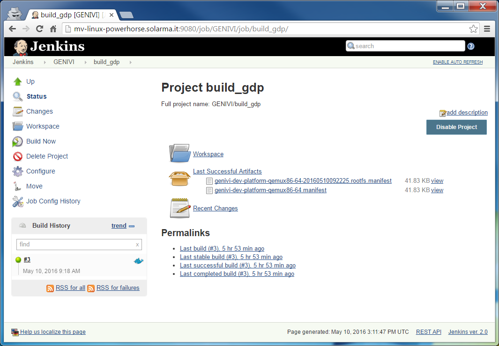
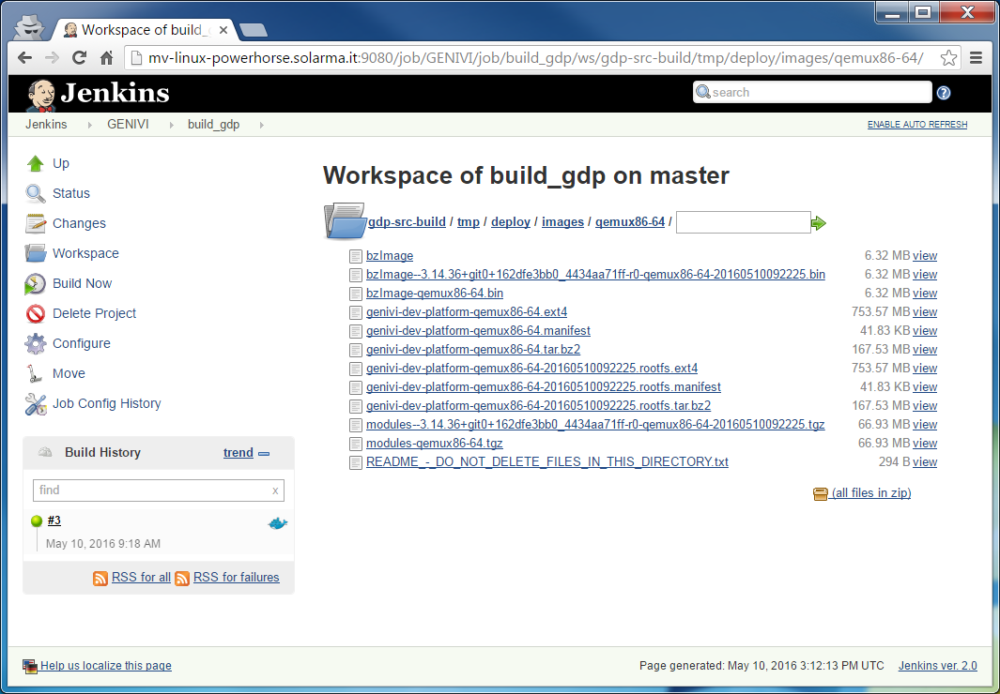

# Building GDP for qemux86-64 using easy-jenkins

<!-- (2016-05-10 11:00 CEST) -->

This document explains how to build from sources the [GENIVI Development Platform](https://at.projects.genivi.org/wiki/x/aoCw) using [Jenkins](https://jenkins.io/).

The actual build is executed inside a [Docker custom build environment](https://wiki.jenkins-ci.org/display/JENKINS/CloudBees+Docker+Custom+Build+Environment+Plugin) which is automatically spun by the Jenkins server.

The following instructions have been tested on:

* Docker client: itm-gmacario-w7 (MS Windows 7 64-bit, Docker Toolbox 1.11.0)
* Docker engine: mv-linux-powerhorse (Ubuntu 14.04.4 LTS 64-bit, Docker 1.11.1, Docker Compose 1.6.0)

## Preparation

* Install and configure [easy-jenkins](https://github.com/gmacario/easy-jenkins) - please refer to [preparation.md](https://github.com/gmacario/easy-jenkins/blob/master/docs/preparation.md) for details.
* Verify that the Jenkins Dashboard is accessible at `${DOCKER_URL}` (example: http://192.168.99.100:9080/)

## Step-by-step instructions

### Create folder `GENIVI`

Browse `${DOCKER_URL}`, then click **New Item**

* Name: `GENIVI`
* Type: **Folder**

then click **OK**. Inside the project configuration page, review configuration, then click **OK**.

### Create project `build_gdp`

<!-- (2016-05-10 11:05 CEST) -->

Browse `${DOCKER_URL}/job/GENIVI`, then click **New Item**

* Name: `build_gdp`
* Type: **Freestyle project**

then click **OK**. Inside the project configuration page, add the following information:

* Discard Old Builds: Yes
  - Strategy: Log Rotation
    - Days to keep build: (none)
    - Max # of builds to keep: 2
* Source Code Management: Git
  - Repositories
    - Repository URL: `https://github.com/GENIVI/genivi-dev-platform.git`
    - Credentials: - none -
  - Branches to build
    - Branch Specifier (blank for 'any'): `*/master`
  - Repository browser: (Auto)
* Build Environment
  - Build inside a Docker container: Yes
    - Docker image to use: Pull docker image from repository
      - Image id/tag: `gmacario/build-yocto-genivi`
    - Advanced...
      - force Pull: Yes
      - Verbose: Yes
* Build
  - Execute shell
    - Command

```
#!/bin/bash -xe

# DEBUG
id
pwd
ls -la
printenv | sort

# Configure git
git config --global user.name "easy-jenkins"
git config --global user.email "$(whoami)@$(hostname)"

# Configure the build
source init.sh qemux86-64

# Prevent error "Do not use Bitbake as root"
[ $(whoami) = "root" ] && touch conf/sanity.conf

# Perform the actual build
bitbake genivi-dev-platform

# TODO: bitbake genivi-dev-platform-sdk

# EOF
```

* Post-build Actions
  - Archive the artifacts
    - Files to archive: `gdp-src-build/tmp/deploy/images/*/*.manifest`

then click **Save**.

### Build project `build_gdp`

Browse `${JENKINS_URL}/job/GENIVI/job/build_gdp/`, then click **Build Now**.

You may watch the build logs at `${JENKINS_URL}/job/GENIVI/job/build_gdp/lastBuild/console`

<!-- (2016-06-21 09:10 CEST) http://ies-genbld01-vm.ies.mentorg.com:9080/job/GENIVI/job/build_gdp/4/console -->

```
Started by user anonymous
[EnvInject] - Loading node environment variables.
Building in workspace /var/jenkins_home/jobs/GENIVI/jobs/build_gdp/workspace
 > git rev-parse --is-inside-work-tree # timeout=10
Fetching changes from the remote Git repository
 > git config remote.origin.url https://github.com/GENIVI/genivi-dev-platform.git # timeout=10
Fetching upstream changes from https://github.com/GENIVI/genivi-dev-platform.git
 > git --version # timeout=10
 > git -c core.askpass=true fetch --tags --progress https://github.com/GENIVI/genivi-dev-platform.git +refs/heads/*:refs/remotes/origin/*
 > git rev-parse refs/remotes/origin/master^{commit} # timeout=10
 > git rev-parse refs/remotes/origin/origin/master^{commit} # timeout=10
Checking out Revision 0368bf68855ce20947e36315e294d1c0d549ce8f (refs/remotes/origin/master)
 > git config core.sparsecheckout # timeout=10
 > git checkout -f 0368bf68855ce20947e36315e294d1c0d549ce8f
 > git rev-list 0368bf68855ce20947e36315e294d1c0d549ce8f # timeout=10
Docker container 806a0c286ca15e53ffc7e4948a96ba1b20d5acb04007e30eceb239acbd31f31d started to host the build
$ docker exec --tty 806a0c286ca15e53ffc7e4948a96ba1b20d5acb04007e30eceb239acbd31f31d env
[workspace] $ docker exec --tty --user 1000:1000 806a0c286ca15e53ffc7e4948a96ba1b20d5acb04007e30eceb239acbd31f31d env 'BASH_FUNC_copy_reference_file%%=() {  f="${1%/}";
 b="${f%.override}";
 echo "$f" >> "$COPY_REFERENCE_FILE_LOG";
 rel="${b:23}";
 dir=$(dirname "${b}");
 echo " $f -> $rel" >> "$COPY_REFERENCE_FILE_LOG";
 if [[ ! -e $JENKINS_HOME/${rel} || $f = *.override ]]; then
 echo "copy $rel to JENKINS_HOME" >> "$COPY_REFERENCE_FILE_LOG";
 mkdir -p "$JENKINS_HOME/${dir:23}";
 cp -r "${f}" "$JENKINS_HOME/${rel}";
 [[ ${rel} == plugins/*.jpi ]] && touch "$JENKINS_HOME/${rel}.pinned";
 fi
}' BUILD_CAUSE=MANUALTRIGGER BUILD_CAUSE_MANUALTRIGGER=true BUILD_DISPLAY_NAME=#4 BUILD_ID=4 BUILD_NUMBER=4 BUILD_TAG=jenkins-GENIVI-build_gdp-4 CA_CERTIFICATES_JAVA_VERSION=20140324 CLASSPATH= COPY_REFERENCE_FILE_LOG=/var/jenkins_home/copy_reference_file.log EXECUTOR_NUMBER=0 GIT_BRANCH=origin/master GIT_COMMIT=0368bf68855ce20947e36315e294d1c0d549ce8f GIT_PREVIOUS_COMMIT=0368bf68855ce20947e36315e294d1c0d549ce8f GIT_URL=https://github.com/GENIVI/genivi-dev-platform.git HOME=/var/jenkins_home HOSTNAME=411d39cbb44e HUDSON_HOME=/var/jenkins_home HUDSON_SERVER_COOKIE=0038592f0fc785b4 JAVA_DEBIAN_VERSION=8u91-b14-1~bpo8+1 JAVA_HOME=/usr/lib/jvm/java-8-openjdk-amd64 JAVA_VERSION=8u91 JENKINS_HOME=/var/jenkins_home JENKINS_SERVER_COOKIE=0038592f0fc785b4 JENKINS_SHA=1fd02a942cca991577ee9727dd3d67470e45c031 JENKINS_SLAVE_AGENT_PORT=50000 JENKINS_UC=https://updates.jenkins.io JENKINS_VERSION=2.9 JOB_BASE_NAME=build_gdp JOB_NAME=GENIVI/build_gdp LANG=C.UTF-8 NODE_LABELS=master NODE_NAME=master PATH=/usr/local/sbin:/usr/local/bin:/usr/sbin:/usr/bin:/sbin:/bin PWD=/ ROOT_BUILD_CAUSE=MANUALTRIGGER ROOT_BUILD_CAUSE_MANUALTRIGGER=true SHLVL=2 TERM=xterm TINI_SHA=066ad710107dc7ee05d3aa6e4974f01dc98f3888 WORKSPACE=/var/jenkins_home/jobs/GENIVI/jobs/build_gdp/workspace /bin/bash -xe /tmp/hudson4309422608057931335.sh
+ id
uid=1000(build) gid=1000(build) groups=1000(build)
+ pwd
/var/jenkins_home/jobs/GENIVI/jobs/build_gdp/workspace
...
Parsing of 1730 .bb files complete (1729 cached, 1 parsed). 2282 targets, 328 skipped, 0 masked, 0 errors.
NOTE: Resolving any missing task queue dependencies

Build Configuration:
BB_VERSION        = "1.28.0"
BUILD_SYS         = "x86_64-linux"
NATIVELSBSTRING   = "Ubuntu-14.04"
TARGET_SYS        = "x86_64-poky-linux"
MACHINE           = "qemux86-64"
DISTRO            = "poky-ivi-systemd"
DISTRO_VERSION    = "10.0.0"
TUNE_FEATURES     = "m64 core2"
TARGET_FPU        = ""
meta              
meta-yocto        
meta-yocto-bsp    = "HEAD:fc45deac89ef63ca1c44e763c38ced7dfd72cbe1"
meta-ivi          
meta-ivi-bsp      = "HEAD:9d72380c1d50d0c3469b85c3a43fe612b5ee1dd9"
meta-oe           
meta-filesystems  
meta-ruby         = "HEAD:ad6133a2e95f4b83b6b3ea413598e2cd5fb3fd90"
meta-qt5          = "HEAD:90919b9d86988e7da01fa2c0a07246b5b5600a5d"
meta-genivi-dev   = "HEAD:10f29d4851387d1d25029cd58d94a5818fd1f6fc"
meta-rust         = "HEAD:f13ac9d48ae928b761d7be204fa8f877d41e7099"
meta-oic          = "HEAD:69146eaf8bc05c74c377e731b7e16d82854a4659"
meta-erlang       = "HEAD:4d7eacc8e6593934ed5b0c8abc3d3e9dc339d849"
meta-rvi          = "HEAD:de9d548fe35e2cee8688faaae910b4f6f7fea17e"

NOTE: Preparing RunQueue
NOTE: Executing SetScene Tasks
NOTE: Executing RunQueue Tasks
...
Currently 1 running tasks (4797 of 4800):
0: genivi-dev-platform-1.3+snapshot-20160621-r0 do_rootfs (pid 2766)
Currently 1 running tasks (4798 of 4800):
0: genivi-dev-platform-1.3+snapshot-20160621-r0 do_rootfs (pid 2766)
No currently running tasks (4798 of 4800)
NOTE: Tasks Summary: Attempted 4800 tasks of which 1886 didn't need to be rerun and all succeeded.

Summary: There were 3 WARNING messages shown.
Stopping Docker container after build completion
Archiving artifacts
Notifying upstream projects of job completion
Finished: SUCCESS
```

**NOTE**: A full build starting from an empty workspace takes about 6 hours to complete (Docker Engine running on a quad-core Intel(R) Xeon(TM) CPU X6550 @2.00GHz, 4 GB RAM + 16 GB swap).



Browse `${JENKINS_URL}/job/GENIVI/job/build_gdp/ws/gdp-src-build/tmp/deploy/images/qemux86-64/` to inspect the build results.



<!-- EOF -->
