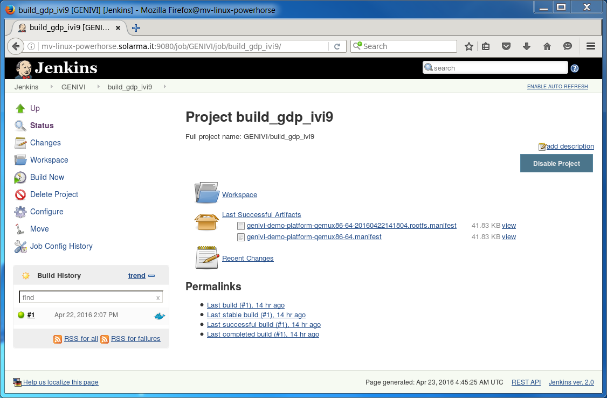
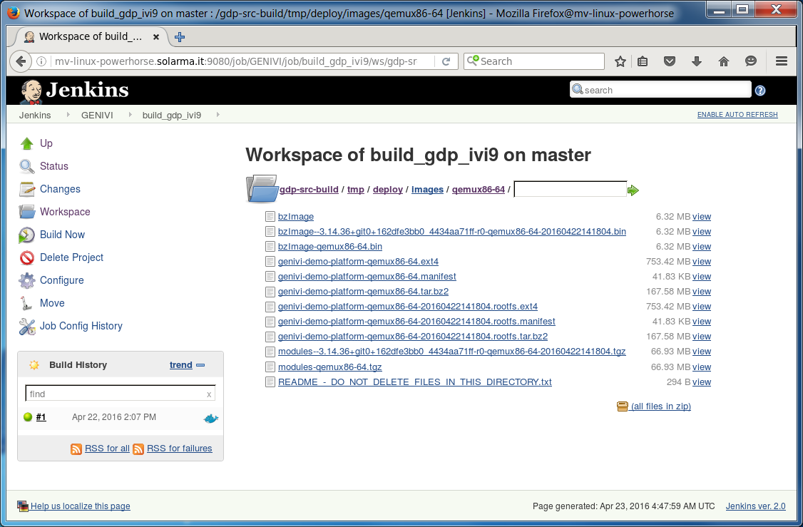

# Building GDP for qemux86-64 using easy-jenkins

**WORK-IN-PROGRESS**

<!-- (2016-05-10 11:00 CEST) -->

This document explains how to build from sources the [GENIVI Demo Platform](https://at.projects.genivi.org/wiki/x/aoCw) using [Jenkins](https://jenkins-ci.org/).

The actual build is executed inside a [Docker custom build environment](https://wiki.jenkins-ci.org/display/JENKINS/CloudBees+Docker+Custom+Build+Environment+Plugin) which is automatically spun by the Jenkins server.

The following instructions have been tested on:

* Docker client: itm-gmacario-w7 (MS Windows 7 64-bit, Docker Toolbox 1.10.2)
* Docker engine: alm-gm-ubu15 (Ubuntu 14.04.4 LTS 64-bit, Docker 1.10.3, Docker Compose 1.6.2)

## Preparation

* Install and configure [easy-jenkins](https://github.com/gmacario/easy-jenkins) - please refer to [preparation.md](https://github.com/gmacario/easy-jenkins/blob/master/docs/preparation.md) for details.
* Verify that the Jenkins Dashboard is accessible at `${DOCKER_URL}` (example: http://192.168.99.100:9080/)

## Step-by-step instructions

### Create folder `GENIVI`

Browse `${DOCKER_URL}`, then click **New Item**

* Name: `GENIVI`
* Type: **Folder**

then click **OK**. Inside the project configuration page, review configuration, then click **OK**.

### Create project `build_gdp_ivi9`

<!-- (2016-04-22 16:03 CEST) -->

Browse `${DOCKER_URL}/job/GENIVI`, then click **New Item**

* Name: `build_gdp_ivi9`
* Type: **Freestyle project**

then click **OK**. Inside the project configuration page, add the following information:

* Discard Old Builds: Yes
  - Strategy: Log Rotation
    - Days to keep build: (none)
    - Max # of builds to keep: 2
* Source Code Management: Git
  - Repositories
    - Repository URL: `git://git.projects.genivi.org/genivi-demo-platform.git`
    - Credentials: - none -
  - Branches to build
    - Branch Specifier (blank for 'any'): `*/qemux86-64`
  - Repository browser: (Auto)
* Build Environment
  - Build inside a Docker container: Yes
    - Docker image to use: Pull docker image from repository
      - Image id/tag: `gmacario/build-yocto-genivi`
    - Advanced...
      - force Pull: Yes
      - Verbose: Yes
* Build
  - Execute shell
    - Command

```
#!/bin/bash -xe

# DEBUG
id
pwd
ls -la
printenv | sort

# Configure git
git config --global user.name "easy-jenkins"
git config --global user.email "$(whoami)@$(hostname)"

# Configure the build
source init.sh

# Prevent error "Do not use Bitbake as root"
[ $(whoami) = "root" ] && touch conf/sanity.conf

# Perform the actual build
bitbake genivi-demo-platform

# EOF
```

* Post-build Actions
  - Archive the artifacts
    - Files to archive: `gdp-src-build/tmp/deploy/images/*/*.manifest`

then click **Save**.

### Build project `build_gdp_ivi9`

Browse `${JENKINS_URL}/job/GENIVI/job/build_gdp_ivi9/`, then click **Build Now**.

You may watch the build logs at `${JENKINS_URL}/job/GENIVI/job/build_gdp_ivi9/lastBuild/console`

<!-- (2016-04-22 16:07 CEST) http://mv-linux-powerhorse.solarma.it:9080/job/GENIVI/job/build_gdp_ivi9/1/console -->

```
Started by user anonymous
[EnvInject] - Loading node environment variables.
Building in workspace /var/jenkins_home/workspace/GENIVI/build_gdp_ivi9
Cloning the remote Git repository
Cloning repository git://git.projects.genivi.org/genivi-demo-platform.git
 > git init /var/jenkins_home/workspace/GENIVI/build_gdp_ivi9 # timeout=10
Fetching upstream changes from git://git.projects.genivi.org/genivi-demo-platform.git
 > git --version # timeout=10
 > git -c core.askpass=true fetch --tags --progress git://git.projects.genivi.org/genivi-demo-platform.git +refs/heads/*:refs/remotes/origin/*
 > git config remote.origin.url git://git.projects.genivi.org/genivi-demo-platform.git # timeout=10
 > git config --add remote.origin.fetch +refs/heads/*:refs/remotes/origin/* # timeout=10
 > git config remote.origin.url git://git.projects.genivi.org/genivi-demo-platform.git # timeout=10
Fetching upstream changes from git://git.projects.genivi.org/genivi-demo-platform.git
 > git -c core.askpass=true fetch --tags --progress git://git.projects.genivi.org/genivi-demo-platform.git +refs/heads/*:refs/remotes/origin/*
 > git rev-parse refs/remotes/origin/qemux86-64^{commit} # timeout=10
 > git rev-parse refs/remotes/origin/origin/qemux86-64^{commit} # timeout=10
Checking out Revision efd5d1d8b43779d968541493fdc3a8f9c52509fc (refs/remotes/origin/qemux86-64)
 > git config core.sparsecheckout # timeout=10
 > git checkout -f efd5d1d8b43779d968541493fdc3a8f9c52509fc
First time build. Skipping changelog.
Pull Docker image gmacario/build-yocto-genivi from repository ...
$ docker pull gmacario/build-yocto-genivi
Using default tag: latest
latest: Pulling from gmacario/build-yocto-genivi
...
Parsing recipes: 100% || Time: 00:00:41

Parsing of 1644 .bb files complete (0 cached, 1644 parsed). 2139 targets, 277 skipped, 0 masked, 0 errors.
[1;29mNOTE[0m: [29mResolving any missing task queue dependencies[0m

Build Configuration:
BB_VERSION        = "1.26.0"
BUILD_SYS         = "x86_64-linux"
NATIVELSBSTRING   = "Ubuntu-14.04"
TARGET_SYS        = "x86_64-poky-linux"
MACHINE           = "qemux86-64"
DISTRO            = "poky-ivi-systemd"
DISTRO_VERSION    = "9.0.1"
TUNE_FEATURES     = "m64 core2"
TARGET_FPU        = ""
meta              
meta-yocto        
meta-yocto-bsp    = "(detachedfrom900d7d6):900d7d6b59c36b2bdbd1c85febec99e80ab54f95"
meta-ivi          
meta-ivi-bsp      = "(detachedfromc6c4be2):c6c4be2e454545fd913ef39f5806990157e8d30a"
meta-oe           
meta-filesystems  
meta-ruby         = "(detachedfroma7c1a2b):a7c1a2b0e6947740758136216e45ca6ca66321fc"
meta-qt5          = "(detachedfrom90919b9):90919b9d86988e7da01fa2c0a07246b5b5600a5d"
meta-genivi-demo  = "(detachedfrom8d73cb3):8d73cb3c2922fd4bb7040fb13094e4d7aff25272"
meta-rust         = "(detachedfromf13ac9d):f13ac9d48ae928b761d7be204fa8f877d41e7099"

[1;29mNOTE[0m: [29mPreparing RunQueue[0m
[1;29mNOTE[0m: [29mExecuting SetScene Tasks[0m
[1;29mNOTE[0m: [29mExecuting RunQueue Tasks[0m
No currently running tasks (1 of 4447)
...
[42A[JCurrently 1 running tasks (4446 of 4447):
0: genivi-demo-platform-1.3+snapshot-20160422-r0 do_rootfs (pid 12904)
[113A[JNo currently running tasks (4446 of 4447)
[42A[J[1;29mNOTE[0m: [29mTasks Summary: Attempted 4447 tasks of which 22 didn't need to be rerun and all succeeded.[0m

Summary: There were 14 WARNING messages shown.
Stopping Docker container after build completion
$ docker kill 0f46e6cbe3e2967ff03545042eea165ad1a32f041a3aaf116f8b30d4c4f4ab2b
0f46e6cbe3e2967ff03545042eea165ad1a32f041a3aaf116f8b30d4c4f4ab2b
$ docker rm --force 0f46e6cbe3e2967ff03545042eea165ad1a32f041a3aaf116f8b30d4c4f4ab2b
0f46e6cbe3e2967ff03545042eea165ad1a32f041a3aaf116f8b30d4c4f4ab2b
Archiving artifacts
Notifying upstream projects of job completion
Finished: SUCCESS
```

**NOTE**: A full build starting from an empty workspace takes about 6 hours to complete (Docker Engine running on a quad-core Intel(R) Xeon(TM) CPU X6550 @2.00GHz, 4 GB RAM + 16 GB swap).



Browse `${JENKINS_URL}/job/GENIVI/job/build_gdp_ivi9/ws/gdp-src-build/tmp/deploy/images/qemux86-64/` to inspect the build results.



<!-- EOF -->
