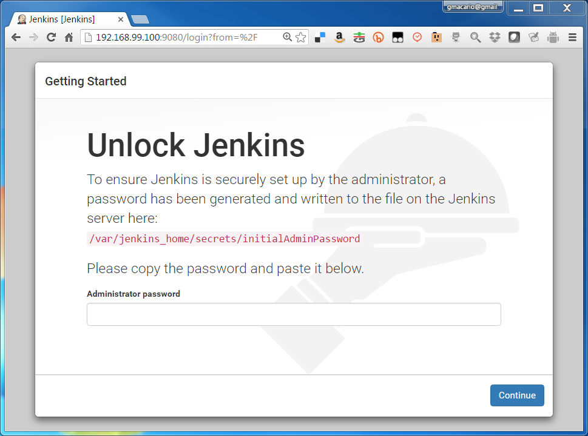
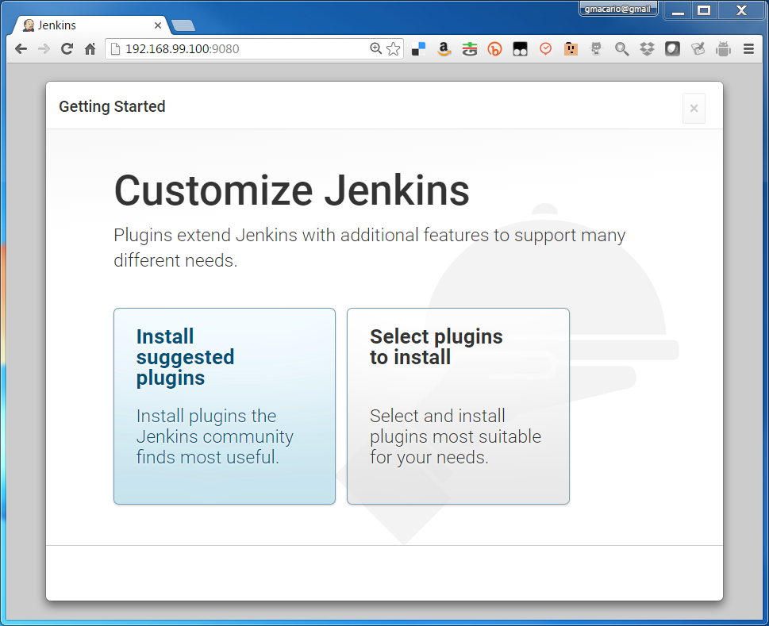
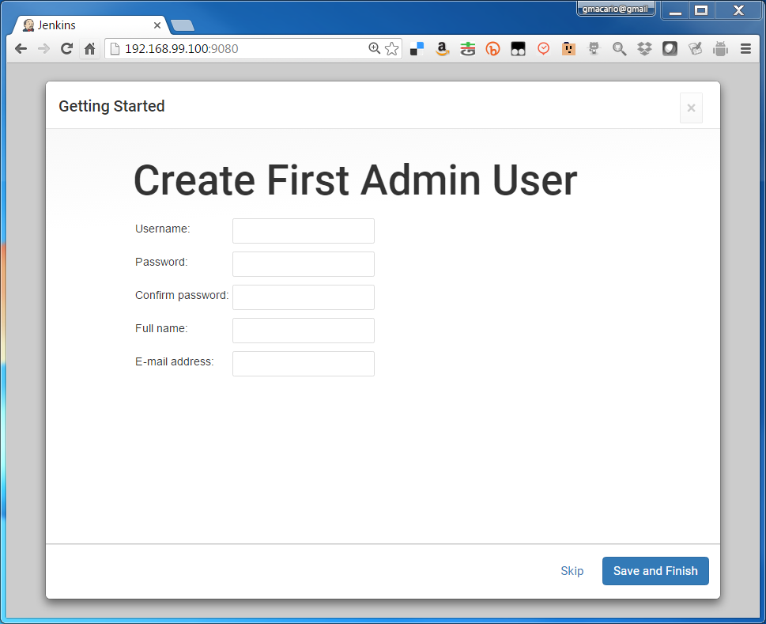
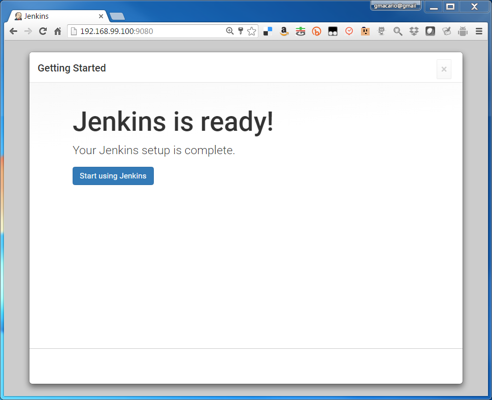
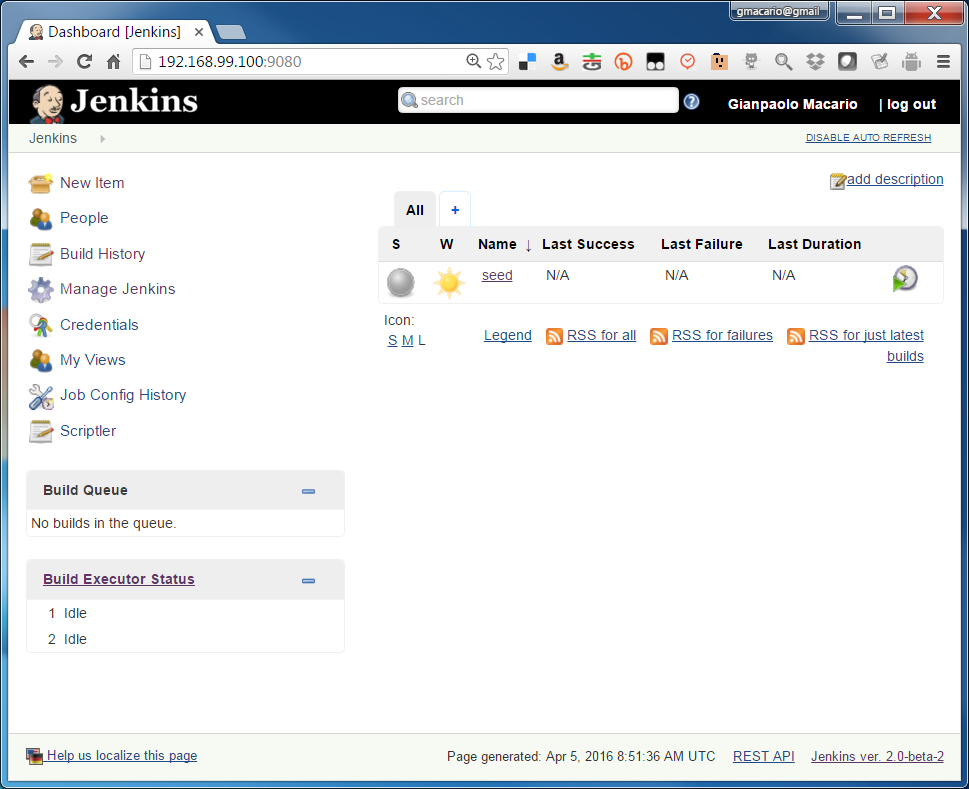

## Installing and preparing easy-jenkins

On a bash shell on the Docker Client, type the following commands to install [easy-jenkins](https://github.com/gmacario/easy-jenkins):

```
$ git clone https://github.com/gmacario/easy-jenkins
$ cd easy-jenkins
$ ./runme.sh
```

Notice that the `runme.sh` will try to create a docker-machine if this is not already available.

A more complex invocation may be used to create the containers to a differnt docker-machine (in the following example, `mv-linux-powerhorse`):

```
$ git clone https://github.com/gmacario/easy-jenkins
$ cd easy-jenkins
$ eval $(docker-machine env mv-linux-powerhorse)  # OPTIONAL - if docker-engine on a different machine
$ docker-compose stop; docker-compose rm -f; docker-compose build --pull
$ ./runme.sh
```

The `$ docker-compose ...` commands are used to make sure the machine runs the most updated images as defined by easy-jenkins.

If the installation is successful, the following messages will be displayed on the launching terminal:

```
gmacario@ITM-GMACARIO-W7 MINGW64 ~/easy-jenkins (master)
$ ./runme.sh
INFO: Docker machine mv-linux-powerhorse exists, skipping docker-machine create
INFO: Using Docker machine mv-linux-powerhorse
Creating easyjenkins_myjenkins_1
Creating easyjenkins_build-yocto-slave_1
INFO: Browse http://192.168.12.22:9080/ to access the Jenkins dashboard
INFO: Run the following command to configure your shell:
INFO: eval $(docker-machine env mv-linux-powerhorse)

gmacario@ITM-GMACARIO-W7 MINGW64 ~/easy-jenkins (master)
$
```

Take note of the `${JENKINS_URL}` (in our example, <http://192.168.12.22:9080/>) where the Jenkins dashboard could be accessed.

Watch docker-compose logs until line `INFO: Jenkins is fully up and running` is displayed:

```
$ eval $(docker-machine env easy-jenkins)
$ docker-compose logs
...
myjenkins_1         | INFO: Completed initialization
myjenkins_1         | Feb 02, 2016 7:05:31 AM hudson.WebAppMain$3 run
myjenkins_1         | INFO: Jenkins is fully up and running
...
```

Browse `${JENKINS_URL}` as explained by the `INFO: Browse xxx to access the Jenkins dashboard` message above and verify that the Jenkins dashboard is displayed correctly.

### Running Jenkins for the first time

Jenkins 2.0 requires to supply an Administrator password before the actual configuration may be completed.



Find the Administrator password using `docker-compose logs` as in the following example

```
$ eval $(docker-machine env easy-jenkins)
$ docker-compose logs
...
myjenkins_1 | INFO:
myjenkins_1 |
myjenkins_1 | *************************************************************
myjenkins_1 | *************************************************************
myjenkins_1 | *************************************************************
myjenkins_1 |
myjenkins_1 | Jenkins initial setup is required. An admin user has been created and a password generated.
myjenkins_1 | Please use the following password to proceed to installation:
myjenkins_1 |
myjenkins_1 | 9805450d56d6418dae8b92ebd3f3098c
myjenkins_1 |
myjenkins_1 | This may also be found at: /var/jenkins_home/secrets/initialAdminPassword
myjenkins_1 |
myjenkins_1 | *************************************************************
myjenkins_1 | *************************************************************
myjenkins_1 | *************************************************************
...
```

**TODO**: Display Administrator password using `docker-compose logs | grep xxx` inside `run.sh`.

Fill in the password in the form, then click **Continue**.

The following page will be displayed



Choose **Install suggested plugins**.

**TODO**: Check whether plugins are already installed from the list at `myjenkins/plugins.txt`.

You will then be shown the "Getting Started - Create First Admin User" page



* Username: `xxx`
* Password: `xxx`
* Confirm password: `xxx`
* Full name: `xxx`
* E-mail address: `xxx`

then click **Save and Finish**.

If everything is OK, a page "Jenkins is ready!" will be displayed.



Click **Start using Jenkins** to proceed.

The Jenkins dashboard should be displayed




### Build project `seed`

Browse `${JENKINS_URL}/job/seed`, then click **Build Now**

Result: The following projects will be generated and show up in the Jenkins dashboard:

1. add_jenkins_slave
2. build_gdp
3. configure_git

<!-- ### Configure git on Jenkins node `master`

Workaround for [issues/26](https://github.com/gmacario/easy-jenkins/issues/26)

Browse `${JENKINS_URL}/job/configure_git/`, then click **Build Now**

Verify in the Console Output that the job was run on the master node (at this point there should not be any slave nodes yet)
-->

<!-- ### Create Jenkins node `build-yocto-slave`

Workaround for [issues/16](https://github.com/gmacario/easy-jenkins/issues/16)

Browse `${JENKINS_URL}/job/add_jenkins_slave/` then click **Build with Parameters**

- AgentList: `build-yocto-slave`
- AgentDescription: `Auto-created Jenkins agent`
- AgentExecutors: `2`
- AgentHome: `/home/jenkins`
- AgentLabels: `yocto`

then click **Build**

Browse `${JENKINS_URL}`, verify that node `build-yocto-slave` is running. -->

<!-- ### Configure git on Jenkins node `build-yocto-slave`

Workaround for [issues/27](https://github.com/gmacario/easy-jenkins/issues/27)

Browse `${JENKINS_URL}/job/configure_git/`, then click **Configure**

- Restrict where this project can be run: Yes
  - Label Expression: `build-yocto-slave`

Click **Save**, then click **Build Now**

Verify in the Console Output that the job was run on the slave. -->

<!-- EOF -->
